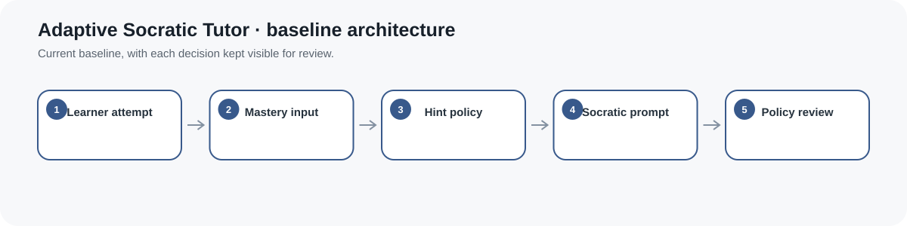
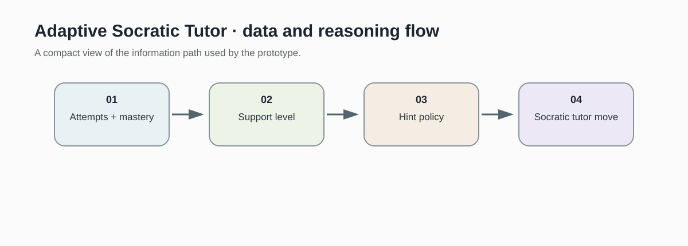
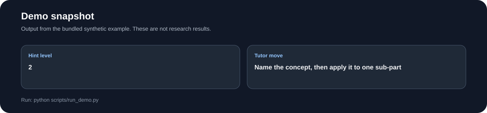
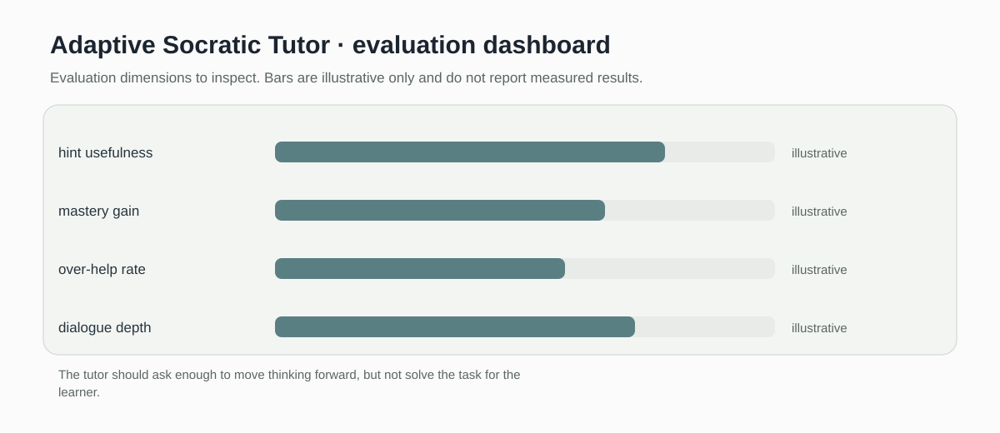

# Adaptive Socratic Tutor

> Inspectable Socratic tutoring baseline that selects restrained hints from attempt history and an explicit mastery estimate.

[](https://github.com/devissaputra/adaptive_socratic_tutor/actions/workflows/ci.yml)



**Area:** AI in Education (AIEd) · Adaptive Instruction & Feedback    
**Status:** working research prototype  
**Author:** Devis Wawan Saputra

## What this project is for

This prototype explores a simple question: how can an AI tutor help without taking the thinking away from the learner? It uses attempt history and an estimated mastery level to choose a restrained tutoring move, from monitoring to a guided hint.

**Who may find it useful:** Researchers and instructional designers studying tutoring policies, productive struggle, and learner-controlled help.

## Questions for empirical validation

The current policy baseline makes these questions testable; the synthetic demo does not answer them.

1. Can a tutoring policy provide useful help without revealing answers too early?
2. How should hint depth respond to attempt history and estimated mastery?
3. Which policy constraints best preserve productive struggle?

## How it works

The current baseline is deliberately transparent. Attempt count and mastery are passed into a small policy that chooses one of four support levels, then maps that level to a Socratic tutoring move. Nothing is hidden behind an external model call, so the decision rule can be inspected line by line.



The flow separates learner evidence, the support decision, and the prompt that follows. That makes it possible to test whether a policy changes help too early, too late, or too aggressively.



This snapshot shows the bundled synthetic example for Adaptive Socratic Tutor. It checks the software path; it is not an empirical performance result.

## Methods in the current baseline

- hint depth policy
- mastery aware scaffolding
- Socratic prompt templates
- answer reveal guardrails
- policy trace review

## Data

Includes synthetic tutoring sessions and no proprietary learner conversations.

`data/README.md` documents the sample schema and the conditions that should be recorded before any real dataset is connected. Restricted or identifiable learner data should stay outside the repository.

## Run the demo

```bash
git clone https://github.com/devissaputra/adaptive_socratic_tutor.git
cd adaptive_socratic_tutor
python scripts/run_demo.py
python -m unittest discover -s tests -v
```

The demo needs only Python. It prints the selected hint level and the tutoring move for a synthetic learner state, which is enough to verify the policy from a fresh clone.

## What to evaluate next

I would next compare this policy with a fixed hint baseline and a stronger adaptive policy. The study should measure hint usefulness, unnecessary help, learner success after a hint, and whether learners still do meaningful work themselves.

## Evaluation view



The Adaptive Socratic Tutor dashboard is an evaluation checklist rather than a result chart. The bars are illustrative only; the labels show the evidence a real study would need to collect.

## Limits and responsible use

This prototype does not estimate mastery from real learner data and it does not generate domain answers. It should be treated as a policy baseline for tutoring research, not as a deployable tutor. See `docs/ethics_and_risks.md` for the broader risk review.

## Repository map

```text
.
├── .github/workflows/ci.yml
├── assets/
│   ├── architecture.svg
│   ├── data_flow.svg
│   ├── demo_snapshot.svg
│   └── evaluation_dashboard.svg
├── data/
│   ├── README.md
│   └── sample.csv
├── docs/
│   ├── ethics_and_risks.md
│   ├── related_work.md
│   └── research_protocol.md
├── reports/model_card.md
├── scripts/run_demo.py
├── src/adaptive_socratic_tutor/core.py
├── tests/test_core.py
├── CITATION.cff
├── LICENSE
├── pyproject.toml
└── README.md
```

## Research path

A credible next version would:

1. connect a real or public tutoring trace with a documented mastery estimate
2. compare at least two support policies under the same tasks
3. review failure cases where the policy gives too much or too little help

## Related work

`docs/related_work.md` points to open projects that are relevant to this problem area. They are context for comparison and study design; this repository does not present their code as its own.

## Citation and license

`CITATION.cff` contains the software citation. The code and original SVG visuals use the MIT License. Any external dataset keeps its own license and usage conditions.
